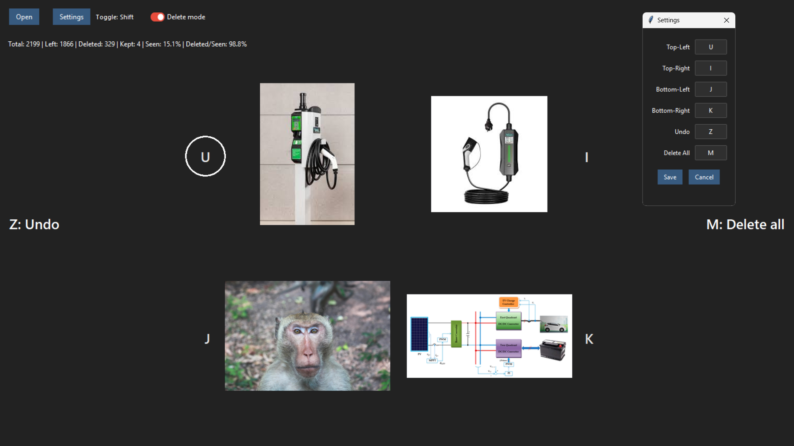

# GridImgViewer

Simple, fast 2x2 image triage tool.
Open a folder, view four thumbnails, delete/copy with hotkeys, undo, calculate stats. Built with Python (Tkinter).



## Features

- Fullscreen, centered 2x2 grid with normalized thumbnails
- Hotkeys for deleting; opening and restoring images
- Clickable thumbnails to open in the system viewer
- calculate and refresh current session statistics
- Sends deletions to system trash, instant backfill
- Remember Last folder, toggle and config

## Usage

- Default Hotkeys: Shift (toggle delete/keep mode), U (top‑left), I (top‑right), J (bottom‑left), K (bottom‑right), M (delete/keep all four), Z (undo)

## Install

### Option 1: Download the latest release

- Go to the [Releases page of this repository](https://github.com/Koussay-Akchi/gridImgViewer/releases).
- Download `GridImgViewer.exe` and run it.

### Option 2: Run from source (Python)

1. Install Python 3.9+.
2. Install dependanciess:

   ```bash
   pip install -r requirements.txt
   ```

3. Run:

   ```bash
   python main.py
   ```
